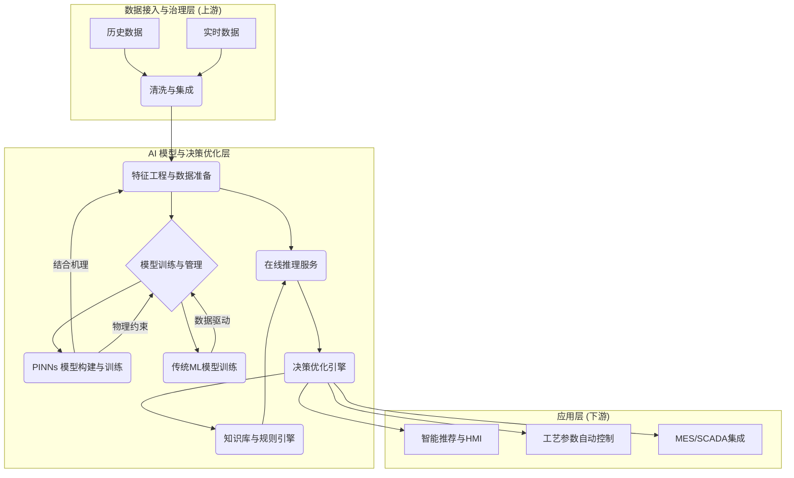

# AI 模型与决策优化层设计 (含 PINNs 应用)

## 1. 业务目标与价值

本层旨在通过先进的AI模型，特别是融合机理知识的PINNs (Physics-Informed Neural Networks) 技术，对染整过程进行精确建模、预测与优化，从而实现：
- **提高染色一次成功率：** 减少返修、废品，降低成本。
- **优化染料/助剂配方：** 降低消耗，减少环境污染。
- **缩短生产周期：** 提高设备利用率，提升产能。
- **提升产品质量稳定性：** 确保每批次产品质量一致性。
- **实现工艺参数智能推荐与自动控制：** 减少人工经验依赖，实现半闭环到全闭环控制。

## 2. 系统边界与数据边界

### 2.1 系统边界

- **上游：** 接收来自“数据接入与治理层”的清洗、整合后的实时与历史工艺数据、设备状态、物料信息、实验数据。
- **下游：** 输出预测结果、优化建议、控制策略给“应用层” (如 MES、SCADA 系统)，并接收来自应用层的决策反馈。
- **内部：** 包含数据预处理、模型训练、模型评估、在线推理、决策优化、知识库管理等核心模块。

### 2.2 数据边界

- **输入数据：**
    - **工艺参数：** 温度、压力、流量、时间、pH值、浴比、织物种类、批次信息等。
    - **染化料信息：** 染料型号、助剂种类、浓度、厂家、成本等。
    - **实验数据：** 小样实验、打样数据、色牢度、白度、色光等。
    - **质检数据：** 生产过程中及成品色差、强度、手感、缩水率等。
    - **设备状态：** 设备运行时间、故障代码、能耗等。
    - **环境数据：** 温度、湿度等（如相关）。
- **输出数据：**
    - **预测值：** 染色结果 (如 L*a*b* 值、K/S 值)、能耗、周期、一次成功率预测。
    - **优化建议：** 染料配方调整建议、工艺参数优化建议。
    - **控制策略：** 针对特定工序 (如升温速率、保温时间) 的建议设定值。
    - **模型健康度：** 模型漂移预警、预测置信度。
    - **PINNs机理参数：** 通过PINNs反演得到的关键物理化学参数 (如染料吸附速率常数、扩散系数)。

## 3. 总体架构图 (Mermaid)



## 4. 核心模块与功能设计

### 4.1 数据预处理与特征工程

- **功能：**
    - 数据清洗、缺失值处理、异常值检测与纠正。
    - 时间序列对齐与重采样。
    - 结合染整专业知识，构建物理特征 (如升温速率、累计吸色量、比表面积影响因子) 和统计特征。
    - PINNs所需的数据格式转换 (如边界条件、初始条件、观测点数据)。
- **输入：** 清洗整合后的原始数据。
- **输出：** 可用于模型训练和推理的特征向量与目标变量。
- **依赖：** 数据接入与治理层。
- **失败模式与回退：** 数据质量差导致特征无效；回退到基于规则的特征生成，并触发数据质量告警。

### 4.2 PINNs 模型构建与训练

- **功能：**
    - **机理方程嵌入：** 将染料吸附、扩散、传热等染整过程的物理化学方程作为惩罚项或约束条件嵌入神经网络损失函数。
    - **数据驱动与机理驱动结合：** 利用少量实验数据校准模型，同时通过机理约束保证模型的物理合理性。
    - **参数反演：** 通过PINNs训练反演得到关键机理参数 (如扩散系数、活化能等)，用于解释和优化。
    - **模型结构设计：** 针对不同工序 (如预处理、染色、后整理) 设计合适的神经网络结构。
- **输入：** 少量实验数据、观测数据、染整过程机理方程、边界条件、初始条件。
- **输出：** 训练好的PINNs模型、反演得到的机理参数。
- **依赖：** 数据预处理与特征工程。
- **失败模式与回退：** 机理方程不准确、数据稀疏导致PINNs训练效果不佳；回退到纯数据驱动的ML模型。

### 4.3 传统 ML 模型训练与管理

- **功能：**
    - 支持 XGBoost, LightGBM, Random Forest, LSTM 等多种机器学习/深度学习模型，用于预测染色结果、能耗、周期等。
    - 模型版本管理、A/B测试、模型监控。
    - 模型自动再训练与更新策略。
- **输入：** 大量历史工艺数据、质检数据。
- **输出：** 训练好的ML模型。
- **依赖：** 数据预处理与特征工程。
- **失败模式与回退：** 模型过拟合、欠拟合、预测精度下降；自动触发模型重训，或切换到上一稳定版本模型，并触发告警。

### 4.4 在线推理服务

- **功能：**
    - 实时接收来自数据接入层的生产数据。
    - 调用训练好的PINNs模型或传统ML模型进行预测。
    - 快速响应，低延迟推理。
    - 模型集成与切换 (如根据工况动态选择最佳模型)。
    - 输出预测置信度、异常检测结果。
- **输入：** 实时工艺参数、物料信息。
- **输出：** 实时预测结果 (如 L*a*b* 值、K/S 值)、预测置信度。
- **依赖：** 数据预处理与特征工程、模型管理。
- **失败模式与回退：** 推理服务崩溃、延迟过高；切换到预设规则或备用模型，触发服务告警。

### 4.5 决策优化引擎

- **功能：**
    - 基于模型预测结果、业务目标 (如成本最低、一次成功率最高、能耗最低) 和工艺约束，生成最优的染料配方和工艺参数建议。
    - 考虑多目标优化，如染料成本与色差的权衡。
    - 支持基于规则的优化与基于模型的优化相结合。
- **输入：** 模型预测结果、业务目标、工艺约束、成本数据。
- **输出：** 优化后的染料配方、工艺参数建议。
- **依赖：** 在线推理服务、知识库与规则引擎。
- **失败模式与回退：** 优化结果不合理、无法满足约束；回退到基于专家经验的推荐，并触发告警。

### 4.6 知识库与规则引擎

- **功能：**
    - 存储专家经验、工艺规范、染料/助剂性能参数、设备限制等知识。
    - 提供规则匹配、规则冲突解决机制。
    - 在模型预测或优化结果不确定时，作为回退或补充机制。
    - 用于定义安全阈值、紧急停机规则等。
- **输入：** 专家知识、工艺文档、历史故障数据。
- **输出：** 规则匹配结果、回退策略、安全约束。
- **依赖：** 无。
- **失败模式与回退：** 规则库不完善、规则冲突；人工介入或采用更保守策略，触发规则库维护告警。

## 5. 核心时序图 (示例：染色结果预测与优化)

```mermaid
sequenceDiagram
    participant A as 数据接入与治理层
    participant B as 在线推理服务
    participant C as PINNs/ML 模型
    participant D as 决策优化引擎
    participant E as 知识库与规则引擎
    participant F as 应用层(HMI/SCADA)

    A ->> B: 实时工艺数据
    activate B
    B ->> B: 数据预处理与特征工程
    B ->> C: 请求预测 (实时特征)
    activate C
    alt PINNs 模型
        C -->> C: PINNs预测 (结合机理)
    else 传统ML模型
        C -->> C: ML模型预测 (数据驱动)
    end
    C -->> B: 预测结果 & 置信度
    deactivate C
    B ->> D: 预测结果 & 业务目标 & 工艺约束
    activate D
    D ->> E: 查询专家规则与安全约束
    activate E
    E -->> D: 规则与约束
    deactivate E
    D -->> D: 执行优化算法
    D -->> B: 优化建议 (配方/参数)
    deactivate D
    B -->> F: 预测结果 & 优化建议
    deactivate B
    F ->> A: 决策反馈 & 实际效果 (持续优化)
