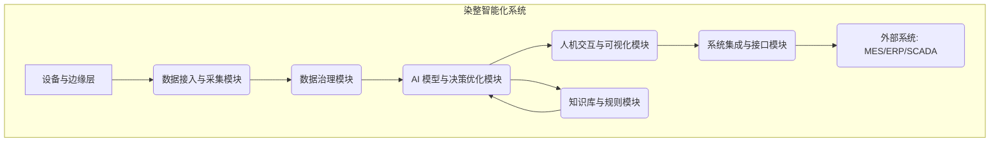

# 功能模块详细设计

## 1. 业务目标

本节旨在详细设计染整智能化系统的各项功能模块，确保系统能够全面支持染整生产的智能化改造，涵盖数据采集、数据治理、AI建模、决策优化、人机交互与系统集成等关键环节。

## 2. 总体功能架构 (Mermaid)

## 3. 核心功能模块详细设计

### 3.1. 数据接入与采集模块

- **功能描述：** 负责从染整生产现场的各类设备、传感器、控制系统（如 PLC、DCS）、历史数据库、LIMS 系统等采集实时和批次数据，并进行初步的数据解析与格式转换。
- **核心功能点：**
    - **多源数据接入：** 支持 OPC UA, Modbus, MQTT, TCP/IP, HTTP, 数据库直连 (JDBC/ODBC), 文件导入等多种协议和数据源。
    - **实时数据采集：** 高并发、低延迟采集生产线上的温度、压力、流量、PH 值、转速、时间等工艺参数。
    - **批次数据采集：** 采集每个生产批次的完整工艺曲线、物料消耗、质检结果等。
    - **数据预解析与标准化：** 将不同设备、不同格式的数据统一解析为标准化的数据结构。
    - **边缘侧数据缓存与上传：** 支持在网络不稳定时进行数据缓存，并在网络恢复后自动上传。
- **输入：** 原始设备数据流、历史数据库连接、LIMS数据接口。
- **输出：** 标准化、结构化的原始数据流。
- **依赖：** 现场设备、网络通信基础设施。
- **状态：** 正常运行、连接异常、数据丢失、缓存溢出。
- **失败模式与回退：**
    - **网络中断：** 边缘侧数据缓存，网络恢复后重传；告警通知。
    - **设备故障/数据源异常：** 记录异常日志，并通知运维人员；系统切换至历史经验规则或最近有效数据。
    - **数据格式不匹配：** 触发数据校验告警，人工介入配置解析规则。

### 3.2. 数据治理模块

- **功能描述：** 对采集到的原始数据进行清洗、转换、关联、存储，构建高质量、可信赖的工业数据集，为上层AI模型提供数据支撑。
- **核心功能点：**
    - **数据清洗：** 缺失值填充、异常值检测与纠正、重复数据删除。
    - **数据转换：** 单位统一、数据类型转换、时间戳对齐、数据平滑与滤波。
    - **数据关联：** 将不同来源、不同时间粒度的数据进行有效关联（如批次号、时间戳），构建宽表。
    - **数据存储：** 建立结构化数据库（如 PostgreSQL）、时序数据库（如 InfluxDB/TDengine）和数据湖（如 HDFS/MinIO）相结合的存储方案。
    - **数据质量监控与告警：** 实时监控数据质量指标（完整性、准确性、一致性、及时性），并对异常进行告警。
    - **数据标签管理：** 支持人工或半自动标注（如一次成功/失败标签、故障类型标签），用于模型训练。
    - **元数据管理：** 记录数据源、数据字段定义、处理规则、血缘关系等信息。
- **输入：** 标准化、结构化的原始数据流。
- **输出：** 清洗、转换、关联后的高质量数据集、数据质量报告、元数据。
- **依赖：** 数据接入与采集模块。
- **状态：** 正常、数据质量异常、存储异常。
- **失败模式与回退：**
    - **数据质量下降：** 触发告警，影响AI模型预测精度；回退到基于规则的决策，并通知数据工程师。
    - **存储系统故障：** 数据写入失败；切换至备用存储，恢复后数据同步。

### 3.3. AI 模型与决策优化模块 (详见独立文档)

- **功能描述：** 包含AI模型的训练、管理、推理与决策优化功能，其中重点应用PINNs技术融合机理知识。
- **核心功能点：**
    - **特征工程服务：** 基于原始数据生成AI模型所需特征。
    - **模型训练与评估：** 支持PINNs和传统ML模型 (如深度学习、集成学习) 的离线训练、在线学习、模型评估。
    - **模型版本管理：** 对不同版本的模型进行管理、A/B测试。
    - **在线推理服务：** 提供高性能、低延迟的模型推理API。
    - **决策优化引擎：** 基于模型预测和业务目标，生成最优工艺参数或配方建议。
    - **模型健康度监控：** 监控模型漂移、预测精度下降等，并自动触发告警或再训练。
- **输入：** 高质量数据集、知识库规则、业务目标。
- **输出：** 预测结果、优化建议、控制策略、模型健康度报告。
- **依赖：** 数据治理模块、知识库与规则模块。
- **状态：** 正常、模型失效、推理服务异常。
- **失败模式与回退：**
    - **模型预测不准确：** 触发模型健康度告警，切换至上一个稳定版本或基于规则的决策，并进行模型重训。
    - **推理服务中断：** 切换至备用推理服务或规则引擎，触发服务告警。

### 3.4. 知识库与规则模块

- **功能描述：** 存储染整领域的专家知识、工艺规范、安全约束、故障诊断经验等，并提供规则管理与执行引擎，作为AI模型的补充和安全兜底。
- **核心功能点：**
    - **知识存储：** 支持结构化（如 RDF 图数据库）、半结构化知识存储。
    - **规则管理：** 基于业务逻辑和专家经验，配置、管理和维护各类生产规则、安全规则、报警规则。
    - **规则引擎：** 提供高效的规则匹配与执行能力，支持复杂条件判断和多规则协同。
    - **专家经验沉淀：** 允许专家通过界面或配置工具，将经验转化为可执行规则。
- **输入：** 专家知识、工艺文档、历史故障数据。
- **输出：** 规则匹配结果、回退策略、安全约束。
- **依赖：** 无。
- **状态：** 正常、规则冲突、规则执行异常。
- **失败模式与回退：**
    - **规则冲突：** 触发告警，人工介入解决冲突，并提供冲突解决策略。
    - **规则引擎故障：** 切换到人工决策或系统默认安全策略，触发服务告警。

### 3.5. 人机交互与可视化模块 (HMI)

- **功能描述：** 提供直观、友好的用户界面，展示生产实时数据、AI预测结果、优化建议、告警信息，并支持用户进行参数调整、策略确认和历史数据查询。
- **核心功能点：**
    - **实时监控看板：** 展示关键工艺参数、设备状态、AI预测曲线、优化建议。
    - **可视化分析：** 支持历史数据查询、趋势分析、多维钻取、异常追溯。
    - **报警与事件管理：** 实时告警推送、告警确认、告警处理流程。
    - **专家交互界面：** 允许专家对AI模型参数、规则进行配置，或对优化建议进行审批/修正。
    - **报告与报表：** 生成生产报表、能耗报告、质量分析报告。
    - **权限与角色管理：** 不同角色拥有不同的操作和查看权限。
- **输入：** AI模型与决策优化模块的输出、数据治理模块的数据、外部系统状态。
- **输出：** 用户操作指令、反馈数据。
- **依赖：** AI模型与决策优化模块、数据治理模块、系统集成与接口模块。
- **状态：** 正常、界面卡顿、数据显示异常。
- **失败模式与回退：**
    - **数据显示异常：** 刷新界面，检查数据源连接，触发前端告警。
    - **用户操作延迟：** 优化前端性能，检查后端接口响应时间。

### 3.6. 系统集成与接口模块

- **功能描述：** 负责与工厂现有的 MES、ERP、SCADA、LIMS 等外部系统进行数据交换和功能集成，确保智能化系统能无缝融入现有IT/OT架构。
- **核心功能点：**
    - **标准API接口：** 提供 RESTful API、gRPC、消息队列 (如 Kafka/RabbitMQ) 等多种形式的接口，供外部系统调用。
    - **数据同步与交换：** 与MES进行生产计划、批次信息、物料消耗数据同步；与SCADA进行控制指令下发与状态回传。
    - **身份认证与授权：** 确保接口调用的安全性。
    - **数据格式转换：** 支持 JSON、XML、Protocol Buffers 等多种数据格式。
    - **接口监控与管理：** 监控接口调用状态、性能，并对异常进行告警。
- **输入：** 外部系统请求、数据。
- **输出：** 外部系统所需数据、控制指令。
- **依赖：** 外部系统。
- **状态：** 正常、接口调用异常、数据同步失败。
- **失败模式与回退：**
    - **接口调用失败：** 重试机制、日志记录、告警通知；人工介入。
    - **数据同步失败：** 差异同步、数据回溯、告警通知。

## 4. 异常流、降级流、回退流

针对上述模块，在每个模块的“失败模式与回退”中已详细描述，这里进行总体性总结：

- **数据层面：** 若数据质量出现问题，优先触发告警并启动数据修复流程。在此期间，AI模型可能降级使用历史数据或仅依赖规则引擎进行决策。
- **模型层面：** 若AI模型预测精度下降或推理服务故障，系统将自动切换到最近稳定的模型版本或完全回退到知识库与规则模块进行决策，并通知相关人员进行模型重训与优化。
- **系统层面：** 若核心服务 (如数据采集、推理服务) 出现故障，优先采用集群热备、服务熔断、限流等技术手段保证核心业务可用性。若无法恢复，则降级为人工干预或停机待修，并提供详细故障日志。
- **控制层面 (重要)：** 任何涉及控制指令下发的操作，都必须优先保障安全。在AI决策存在不确定性、数据质量差或系统异常时，自动回退到人工确认模式或预设的安全规则进行控制，避免误操作导致生产事故。严格遵循“建议 -> 人工确认 -> 半闭环 -> 全闭环”的渐进式路线。

## 5. 安全与审计

- **安全：** 
    - **数据加密：** 敏感数据存储和传输加密。
    - **权限管理：** 基于角色的访问控制（RBAC）。
    - **API安全：** Token认证、API限流。
    - **网络隔离：** 生产网络与办公网络隔离，内部系统最小化暴露。
- **审计：**
    - **操作日志：** 记录所有关键操作，包括用户行为、系统决策、控制指令下发。
    - **决策追溯：** 记录AI模型每次决策的输入、输出、置信度及采用的规则。
    - **数据血缘：** 追踪数据从采集到应用的全链路，确保数据可追溯。
