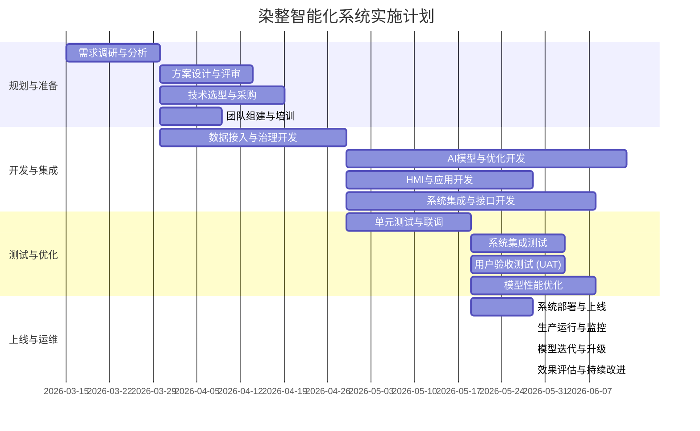

# 实施计划与风险管理

## 1. 业务目标

本节旨在规划染整智能化系统的实施路径、时间节点和资源配置，并识别项目实施过程中可能面临的风险，提出预防和应对措施，确保项目按时、按质、按预算完成。

## 2. 实施计划

### 2.1. 总体实施阶段

项目将分为四个主要阶段：规划与准备、开发与集成、测试与优化、上线与运维。

### 2.2. 关键里程碑

| 里程碑 | 时间节点 | 交付物 |
|---|---|---|
| **阶段一完成** | 2026-04-30 | 详细需求文档、系统设计方案、技术选型报告、采购清单、项目团队组建 |
| **数据平台搭建** | 2026-05-30 | 完成数据接入与治理平台核心功能开发，实现主要设备数据采集与清洗 |
| **AI模型初步验证** | 2026-07-15 | 完成核心AI模型（含PINNs）离线训练与初步验证，产出预测原型 |
| **HMI原型交付** | 2026-07-30 | 完成人机交互界面的初步原型开发，展示实时监控与基本预测功能 |
| **系统集成测试完成** | 2026-08-30 | 完成系统内部各模块及与MES/SCADA的联调测试，功能达到设计要求 |
| **用户验收测试完成** | 2026-09-15 | 用户完成系统功能及性能验收，提出修改意见并完成修改 |
| **系统正式上线** | 2026-09-30 | 系统在生产环境稳定运行，各项功能投入使用 |

## 3. 资源配置

### 3.1. 人力资源

- **项目经理：** 1名，负责项目整体规划、进度控制、风险管理、沟通协调。
- **系统架构师：** 1名，负责系统总体架构设计、技术选型、关键技术攻关。
- **后端开发工程师：** 2-3名，负责数据接入、治理、AI推理服务、接口开发。
- **前端开发工程师：** 1-2名，负责人机交互界面开发、可视化。
- **AI工程师/数据科学家：** 2名，负责AI模型（含PINNs）开发、训练、优化、部署。
- **工业自动化工程师：** 1名（外部或内部兼职），负责现场设备联调、协议适配。
- **染整工艺专家：** 1名（内部兼职），提供业务知识、数据标注、模型验证。

### 3.2. 软硬件资源

- **硬件：** 工业边缘网关、服务器（GPU支持）、存储、工业交换机、相关传感器/仪表。
- **软件：** 操作系统、虚拟化软件、数据库（时序/关系型）、消息队列、容器化平台、AI框架、开发工具、监控告警系统。

## 4. 风险管理

项目风险将从技术、数据、人员、管理、外部环境等方面进行识别、评估、监控和应对。

### 4.1. 风险识别与评估 (详见《技术可行性分析》和《经济可行性分析》中的风险部分)

### 4.2. 风险应对策略

| 风险类别 | 具体风险 | 应对策略 |
|---|---|---|
| **技术风险** | **数据采集困难** | 提前进行现场调研，明确设备接口；采用多协议兼容网关；针对老旧设备预留改造预算和时间。
| | **PINNs建模复杂** | 组建跨学科团队；先进行仿真验证；采用混合模型策略（PINNs+ML）；预留研发周期。
| | **系统集成复杂** | 采用标准API接口和消息队列解耦；与外部系统团队紧密协作，充分测试；预留集成时间。
| **数据风险** | **数据质量不佳** | 建立完善数据治理体系；定义数据质量标准；实时数据质量监控告警；引入工艺专家校核数据。
| | **数据安全隐私** | 数据加密、权限控制、网络隔离、审计追溯；遵守相关法规。
| **人员风险** | **技术人才短缺** | 内部培养与外部招聘结合；与高校合作；提供专业培训；合理进行任务分配。
| | **团队沟通不畅** | 建立定期例会机制；使用统一项目管理工具；加强跨部门协作。
| **管理风险** | **项目范围蔓延** | 严格控制需求变更流程；建立清晰的范围基线；采用迭代开发模式。
| | **进度滞后** | 制定详细 WBS (工作分解结构)；关键路径管理；定期回顾与调整；增加资源投入或调整优先级。
| | **预算超支** | 严格控制采购流程；定期财务审计；预留风险准备金；优先采用开源技术降低成本。
| **外部环境风险** | **供应商依赖风险** | 考察多个供应商；签订清晰的合同与SLA；建立备选方案。
| | **政策法规变化** | 持续关注行业政策与环保法规变化，及时调整技术方案或业务流程。

### 4.3. 风险监控与控制

- **定期风险评审：** 每周/双周召开项目风险评审会，评估风险状态、更新风险清单、调整应对措施。
- **风险责任人：** 为每个主要风险指定责任人，负责风险的跟踪和应对。
- **风险预警机制：** 建立关键指标阈值，当指标超出阈值时自动触发风险告警。
- **变更管理：** 任何可能影响项目范围、进度、成本的变更都需经过严格的评审和批准流程。

## 5. 结论

染整智能化系统的实施将是一个复杂且具有挑战性的过程，需要周密的计划和有效的风险管理。通过明确的项目阶段、里程碑、合理的资源配置以及全面的风险识别与应对策略，可以最大限度地降低项目风险，确保项目成功交付并实现预期价值。强调团队协作、技术创新与业务落地的紧密结合，是项目成功的关键。
